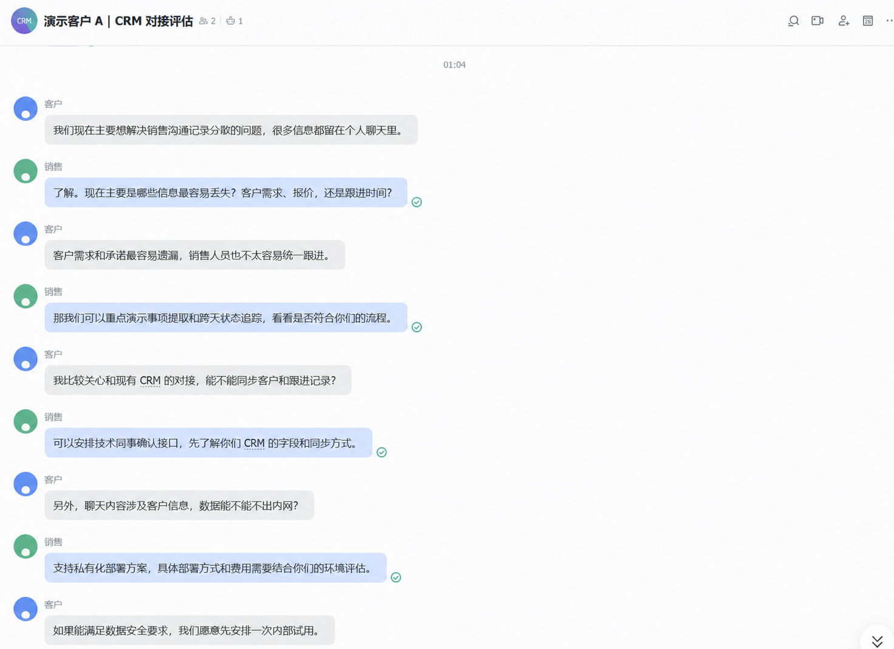
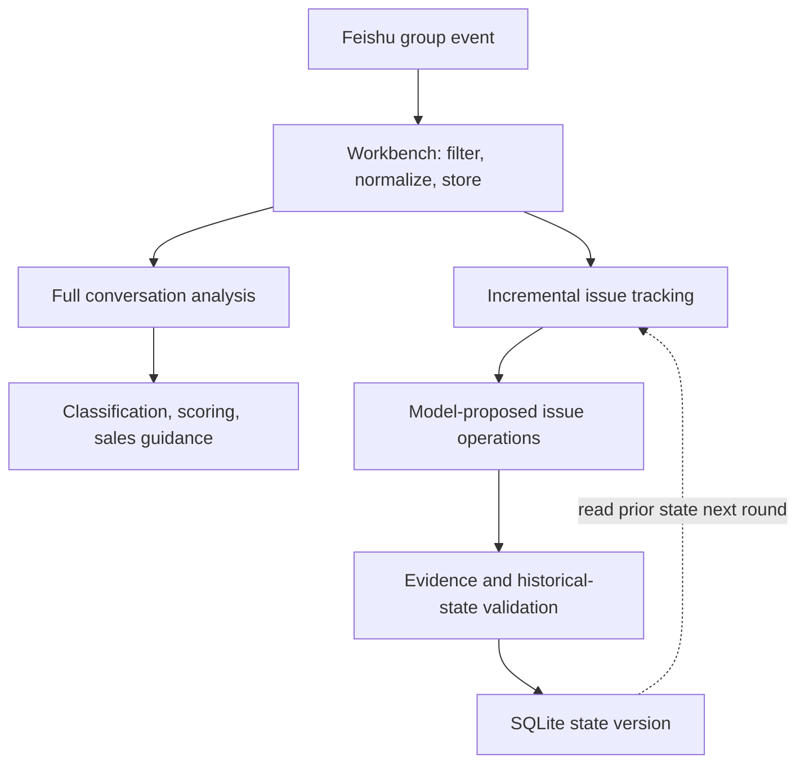

# DealTrace | Feishu Sales Conversation Issue Tracker

[中文说明](README.zh-CN.md)

DealTrace extracts customer needs, concerns, risks, follow-ups, and commitments from Feishu group chats. It preserves each issue’s status and source evidence across conversations so that changes can be reviewed against the original messages.

## Demo

> **[Open the offline demo](https://sheily899.github.io/feishu-sales-dealtrace/)** — opens directly in the browser; no setup or API key required.


The public demo uses ten bundled anonymized sales messages and a precomputed report. It does not call a model or consume API quota.

### Anonymized Feishu conversation

The screenshot below is a real Feishu group-chat exchange supplied for this project and anonymized for privacy: participant names are replaced with **Customer** and **Sales**, and personal avatars are replaced with generic avatars. It is included to show the actual input form the workbench is designed to process; it is not part of the public evaluation set.



Demo path: open the public link, then inspect issues, state, and source evidence.

## Workflow

Unresolved issues are not removed merely because the next conversation changes topic. Unsupported state changes are rejected and the previous state is preserved.

Data flow:



### Core modules

| Module | Input | Output | Why it exists | Failure impact |
|---|---|---|---|---|
| Feishu integration | Feishu group events | Normalized messages | Isolates external-system formats | Messages cannot be received or are misread |
| Role identification | Sender IDs and role config | Customer/sales roles | The same words mean different things by speaker | Customer needs and sales commitments get mixed |
| Conversation analysis | Full chat history | Classification, scoring, guidance | Provides a sales-oriented overview | Report is inaccurate, but should not directly mutate state |
| Issue extraction | Prior state and new messages | IssueOperation | Natural language cannot be covered by rules alone | Issues are missed or incorrect changes are proposed |
| State validation | Model operations, history, evidence | Accepted or rejected results | The model is not trusted blindly | Invalid state enters the customer record |
| SQLite storage | Messages, reports, changes | Versioned state history | Supports cross-round tracking and recovery | History is lost after restart |
| Workbench | Messages, reports, state, evidence | Visual page | Lets sales inspect conclusions and sources | The system remains a backend-only result |
| Evaluation | Golden issues and actual output | P/R/F1 and evidence rate | Tests whether changes really work | Prompt changes become guesswork |

The model proposes analysis results. The state module validates and persists the canonical state, and the next message batch reads the previous snapshot.

## Features

- Normalize Feishu events and identify customer and sales roles;
- Extract needs, concerns, risks, stakeholders, commitments, todos, and next steps;
- Preserve unresolved issues across days and support create, update, accepted-workaround, and resolved states;
- Link accepted changes to source messages;
- Save state versions, analysis output, and rejection reasons.

## Feishu integration

Live Feishu mode requires the Feishu connector and LLM client dependencies. The public offline demo needs neither.

Live mode stores messages and state in `data/workbench.sqlite3`. It is a single-machine prototype without authentication, multi-tenancy, full CRM permissions, or automatic task dispatch.

### Feishu setup

1. Open the [Feishu Open Platform](https://open.feishu.cn/app) and sign in as an enterprise administrator.
2. Create an enterprise app. Copy its `App ID` and `App Secret` from the app details page.
3. Enable the group-message read/receive permissions and group-message event subscription, then publish a testable app version.
4. Add the app to a dedicated test group and note its group ID (usually starts with `oc_`).
5. Copy `.env.example` to `.env` and fill in:
   - `FEISHU_APP_ID` and `FEISHU_APP_SECRET` from the app details;
   - `FEISHU_GROUP_ALLOWLIST` with one or more comma-separated group IDs;
   - `FEISHU_ROLE_MAP` to map group members to customer or sales roles;
   - `DEEPSEEK_API_KEY` only for live analysis; the Offline demo never reads it.
6. In PowerShell at the project root, verify Python 3.10 or newer:
   ```powershell
   python --version
   ```
7. (Recommended) Create and activate a virtual environment:
   ```powershell
   python -m venv .venv
   .venv\Scripts\Activate.ps1
   ```
8. Install the base package, DeepSeek clients, and Feishu connector:
   ```powershell
   python -m pip install --upgrade pip
   python -m pip install -e ".[llm,feishu]"
   ```
9. Copy `.env.example` to `.env` and fill in `FEISHU_APP_ID`, `FEISHU_APP_SECRET`, `FEISHU_GROUP_ALLOWLIST`, `FEISHU_ROLE_MAP`, and `DEEPSEEK_API_KEY`.
10. Start live mode:
   ```powershell
   python -m dealtrace workbench --feishu --port 8766
   ```
11. Open <http://127.0.0.1:8766/>, send a message in the test group, and click **Generate analysis**.

Troubleshooting: an empty chat list usually means the group ID is not allowlisted; a missing report usually means the model key or network is unavailable. Use the port-8765 Offline demo to explore the UI without a live connection.

Keep all secrets in the local `.env`; never commit them.

## Evaluation

The evaluation set contains six sales scenarios, six cases, and 18 sequential rounds covering discovery, product demo, technical integration, pricing, post-signing implementation, and renewal handling.

Current internal evaluation (`deepseek-v4-flash`, seed 42, single run):

| Metric | Result | Meaning |
|---|---:|---|
| Change precision | 84.6% | How often each recorded addition or resolution matches the conversation |
| Change recall | 61.1% | How many real changes in the conversation were captured in time |
| State precision | 94.1% | How many items kept in the customer record are supported by chat evidence |
| State recall | 66.7% | How many items that should be kept in the customer record were retained |
| Evidence traceability | 100% | Whether every analysis result links back to its source message |

These figures come from a small internal set. They validate short-horizon multi-turn tracking, not months-long production conversations.

```bash
python evals/run_eval.py
```

## Layout

```text
src/dealtrace/     Core application, Feishu integration, LLM, and state logic
fixtures/          Anonymized local demo events
prompts/           Analysis prompts
schemas/           Output schemas
evals/             Golden cases and evaluators
tests/             Automated tests
```

## Next steps

- Expand the evaluation set with real, multi-industry conversations over longer sales cycles;
- Add item-level review and edit history so sales teams can correct analyses quickly;
- Add access control, sensitive-data redaction, and retention policies before wider deployment;
- Reduce model cost and latency while keeping every result traceable to source messages.

## Privacy and security

Never commit `.env`, API keys, or real customer conversations. Add authentication, authorization, retention, and redaction controls before production use.

## License

Apache-2.0. See [LICENSE](LICENSE).
