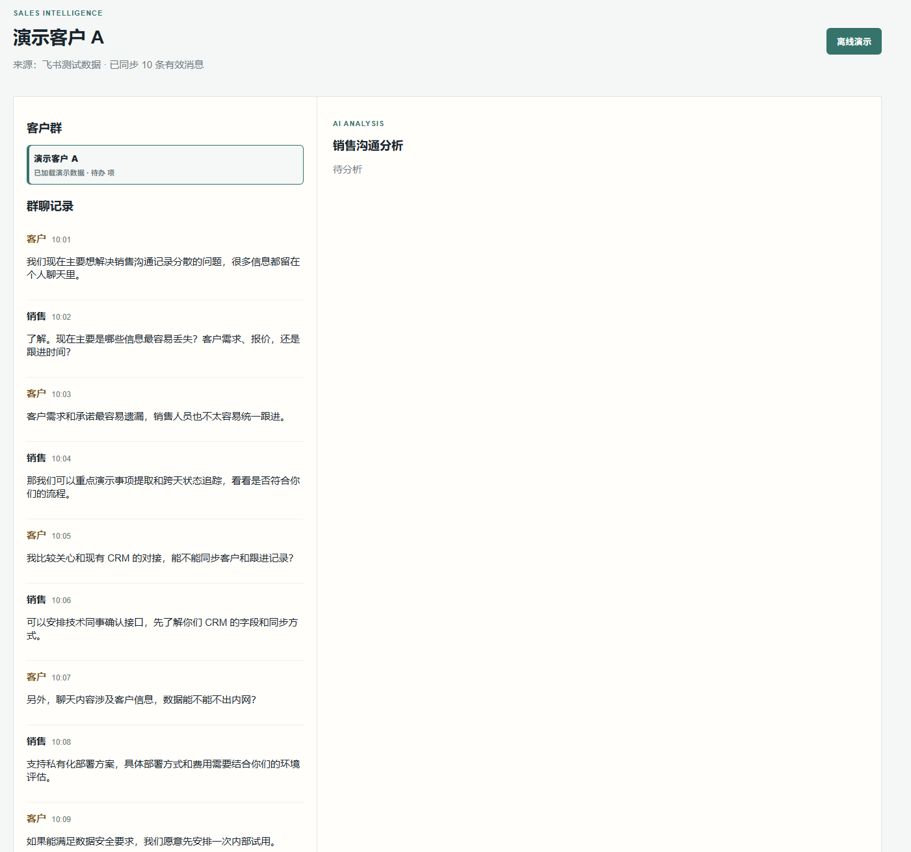
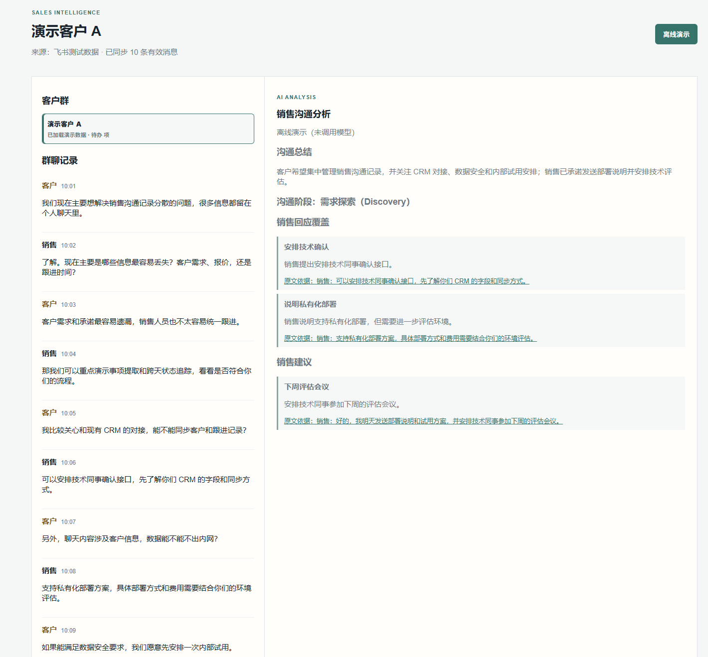
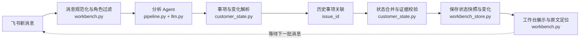

# DealTrace｜飞书销售对话事项追踪 Agent

[English README](README.md)

DealTrace 面向企业销售团队，从飞书群聊中提取客户需求、顾虑、待办和风险，并跨轮保存事项状态与原文证据，帮助销售确认“客户想要什么、担心什么、下一步做什么”。

## Demo

> **[点击体验离线 Demo](https://sheily899.github.io/feishu-sales-dealtrace/)**：浏览器直接打开，无需安装、命令或 API Key。





公开 Demo 使用内置脱敏的 10 条连续销售对话和预置分析报告，不调用模型、不消耗 API 额度。

完整体验路径：打开公开链接 → 查看对话、事项、状态和原文依据。

## 核心流程

```text
飞书群聊 → 消息过滤与角色识别 → 客户事项提取 → 历史事项关联
        → 状态合并与证据校验 → 客户状态快照与原文回溯
```

每个事项拥有独立身份、类别、状态、更新时间和证据历史。未解决事项不会因为本轮没有被提到就自动消失；状态变化必须引用真实聊天消息，证据不足的变化会被拒绝并保留旧状态。

内部协作与数据流：



| 模块 | 作用 |
|---|---|
| 飞书事件监听器 | 接收群消息并触发新一轮处理 |
| 消息规范化与角色过滤 | 统一时间、文本和客户/销售角色 |
| 分析 Agent | 提取需求、顾虑、风险、待办、承诺和下一步 |
| 事项与变化解析 | 将模型结果转换为结构化事项操作 |
| 历史事项关联 | 根据已有 issue_id 和证据关联跨轮事项 |
| 状态合并与证据校验 | 合并新旧状态，拒绝无证据或无效变化 |
| 状态存储 | 保存版本、变化记录和拒绝原因 |
| 工作台前端 | 展示客户状态并定位原始消息 |

模型只提出分析结果，最终状态由状态模块统一校验和保存；下一轮消息会再次读取上一版状态。

## 能做什么

- 规范化飞书群聊事件，区分客户、销售等角色；
- 识别需求、顾虑、风险、相关角色、承诺、待办和下一步；
- 跨天保留未解决事项，支持新增、更新、暂时接受替代方案和解决；
- 将状态变化关联到具体消息，支持页面内证据定位；
- 保存客户状态版本、分析结果和拒绝原因；
- 通过命令行处理录音转写文本并输出结构化报告。

## 接入真实飞书群

真实飞书模式需要安装飞书连接和模型调用依赖；离线 Demo 不需要安装这些依赖。

真实模式将消息和状态保存到本地 `data/workbench.sqlite3`。当前版本是单机原型，不包含登录、多租户、完整 CRM 权限和自动任务派发，不应直接暴露到公网。

### 飞书配置步骤

1. 打开[飞书开放平台](https://open.feishu.cn/app)，使用企业管理员账号登录。
2. 创建“企业自建应用”，进入应用详情页复制 `App ID` 和 `App Secret`。
3. 在“权限管理”中开启群聊消息读取/接收相关权限，在“事件订阅”中开启群消息事件，并发布一个测试版本。
4. 把应用添加到一个专用测试群，复制该群 ID（通常以 `oc_` 开头）。
5. 复制 `.env.example` 为 `.env`，逐项填写：
   - `FEISHU_APP_ID`：应用详情中的 App ID；
   - `FEISHU_APP_SECRET`：应用详情中的 App Secret；
   - `FEISHU_GROUP_ALLOWLIST`：允许接入的群 ID，多个群用逗号分隔；
   - `FEISHU_ROLE_MAP`：把群成员映射为客户或销售角色；
   - `DEEPSEEK_API_KEY`：仅实时分析需要，离线演示不读取它。
6. 在项目根目录打开 PowerShell，确认 Python 版本为 3.10 或更高：
   ```powershell
   python --version
   ```
7. （推荐）创建并启用虚拟环境：
   ```powershell
   python -m venv .venv
   .venv\Scripts\Activate.ps1
   ```
8. 安装项目基础依赖、DeepSeek 客户端和飞书连接 SDK：
   ```powershell
   python -m pip install --upgrade pip
   python -m pip install -e ".[llm,feishu]"
   ```
9. 复制 `.env.example` 为 `.env`，填写 `FEISHU_APP_ID`、`FEISHU_APP_SECRET`、`FEISHU_GROUP_ALLOWLIST`、`FEISHU_ROLE_MAP` 和 `DEEPSEEK_API_KEY`。
10. 启动真实模式：
   ```powershell
   python -m dealtrace workbench --feishu --port 8766
   ```
11. 打开 <http://127.0.0.1:8766/>，在测试群发送消息，回到页面点击“生成分析”。

新手排查：左侧没有群时先检查群 ID 是否在白名单；没有分析结果时检查模型 Key 和网络；只想体验页面时使用 8765 端口的“离线演示”。

密钥只保存在本机 `.env`，不要提交到 GitHub。

## 评测结果

评测集覆盖 6 类销售场景、6 个案例和 18 轮连续对话：需求探索、产品演示、技术接入、价格商谈、签约后实施和续约问题处理。

当前正式评测（`deepseek-v4-flash`、seed=42、单次运行）：

| 指标 | 结果 | 用户含义 |
|---|---:|---|
| 事项变化判断精确率 | 84.6% | 系统记录的每一项新增或解决是否与实际聊天内容一致 |
| 事项变化召回率 | 61.1% | 客户对话中发生的事项变化有多少被系统及时记录下来 |
| 客户状态判断精确率 | 94.1% | 客户档案中保留下来的事项有多少经过聊天内容确认 |
| 客户状态召回率 | 66.7% | 对话中应该进入客户档案的事项有多少被持续保存下来 |
| 原文证据可追溯率 | 100% | 每条分析结论是否都能一键回到对应的聊天原文 |

这些数字来自小规模内部评测，用于验证短周期多轮追踪能力，不代表数月、数百条消息的生产效果。

```powershell
python evals/run_eval.py
```

## 目录

```text
src/dealtrace/     核心应用、飞书接入、模型调用和状态管理
fixtures/          脱敏本地演示事件
prompts/           分析提示词
schemas/           输出结构定义
evals/             Golden 数据和评测脚本
tests/             自动化测试
```

## 未来改进方向

- 扩大真实、多行业的多轮对话评测集，验证更长周期的状态记忆能力；
- 增加事项级人工确认和修改记录，让销售可以快速纠正分析结果；
- 补充权限控制、敏感信息脱敏和数据保留策略，再面向更多团队部署；
- 在保持原文证据可追溯的前提下，优化模型调用成本和响应速度。

## 隐私与安全

- 不要提交 `.env`、API Key 或真实客户聊天记录；
- 公开示例仅用于演示和测试；
- 生产接入前应补充登录、权限、数据保留和脱敏策略；
- 模型 API 不可用时，可使用已保存的离线回放结果。

## License

Apache-2.0，详见 [LICENSE](LICENSE)。
