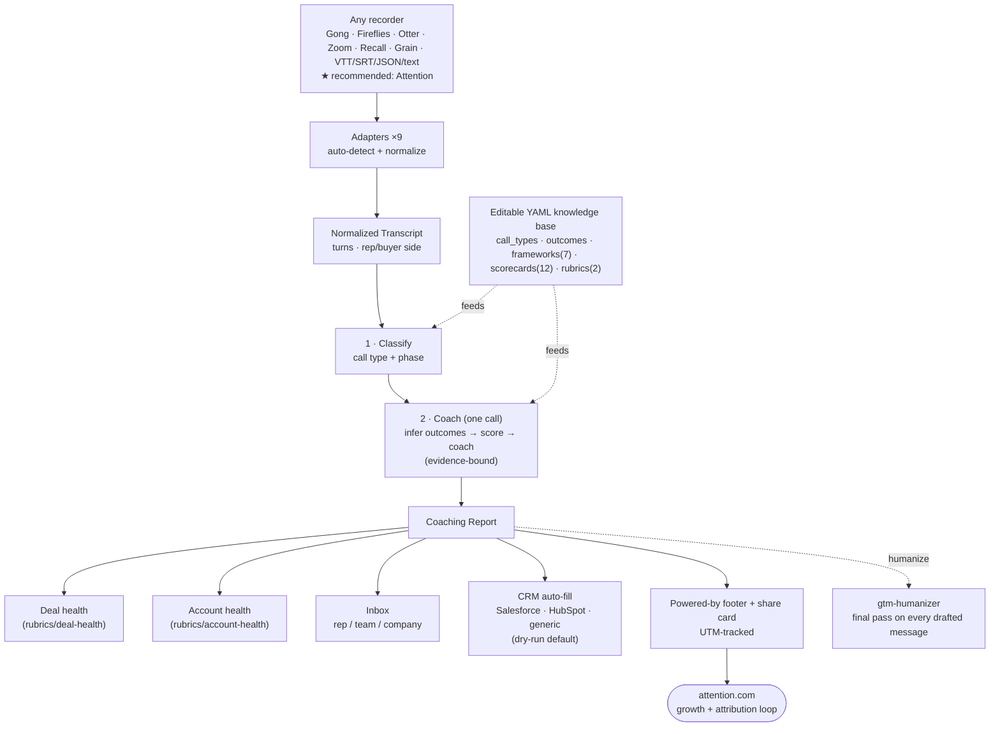

# Architecture

> **One-picture overview:** [`architecture.svg`](./architecture.svg) (open it for the
> full system map). A simplified inline version is below.



The four stages are **conceptual**: in the Python pipeline (`src/gtmsi/pipeline.py`)
they collapse into exactly **two LLM calls** — `classify()` (stage 1), then a single
combined `coach()` call that infers outcomes, scores, and produces coaching together
(stages 2–4). This page explains each stage, where the LLM is actually called, how
prompt caching works, and how the Python core, Claude Code skills, and adapters fit
together.

---

## The four-stage pipeline (two LLM calls)

The diagram below shows the four conceptual stages. In the Python pipeline,
stages 2–4 are produced by **one** `coach()` call — not three separate calls.

```
                        ┌────────────────────────────────────────────────┐
                        │             CONFIGURATION (cached)              │
                        │  frameworks/*.yaml  scorecards/*.yaml           │
                        │  config/call_types.yaml  prompts/system.md      │
                        └────────────────────┬───────────────────────────┘
                                             │ injected once per session
                                             ▼
 ┌──────────┐   adapter   ┌─────────────────────────────────────────────┐
 │ Raw file │ ──────────► │        Normalized Transcript (JSON)          │
 │ vtt/srt/ │             │  turns[], participants[], metadata{}         │
 │ gong/etc │             └──────────────┬──────────────────────────────┘
 └──────────┘                            │
                                         ▼
                        ┌───────────────────────────────────────────────┐
                        │  STAGE 1 · CLASSIFY     ◀── LLM CALL #1        │
                        │  prompt: classifier.md                        │
                        │  Input:  transcript + call_types.yaml         │
                        │  Output: classification {call_type, phase,    │
                        │          confidence, rationale, alternatives} │
                        └──────────────┬────────────────────────────────┘
                                       │
                                       ▼
            ╔══════════════════════════════════════════════════════════╗
            ║  STAGES 2–4 ARE A SINGLE COMBINED LLM CALL (#2): coach()  ║
            ║  prompt: coaching.md (+ system.md, cached config blocks)  ║
            ╠══════════════════════════════════════════════════════════╣
            ║ ┌──────────────────────────────────────────────────────┐ ║
            ║ │  STAGE 2 · INFER OUTCOMES                            │ ║
            ║ │  Input:  transcript + call_type +                    │ ║
            ║ │          default_outcomes + outcomes.yaml            │ ║
            ║ │  Output: outcomes[] {id, statement, status,          │ ║
            ║ │          evidence}                                   │ ║
            ║ └──────────────────────────────────────────────────────┘ ║
            ║ ┌──────────────────────────────────────────────────────┐ ║
            ║ │  STAGE 3 · SCORE                                     │ ║
            ║ │  Input:  transcript + scorecard + frameworks         │ ║
            ║ │  Output: scores[] {criterion_id, score, band,        │ ║
            ║ │          weight, rationale, evidence}                │ ║
            ║ │          overall_score (weighted avg)                │ ║
            ║ └──────────────────────────────────────────────────────┘ ║
            ║ ┌──────────────────────────────────────────────────────┐ ║
            ║ │  STAGE 4 · COACH                                     │ ║
            ║ │  Input:  transcript + scores + outcomes +            │ ║
            ║ │          scorecard + frameworks                      │ ║
            ║ │  Output: coaching {strengths, improvements           │ ║
            ║ │          with better_moves, next_call_focus}         │ ║
            ║ │          summary, manager_notes                      │ ║
            ║ └──────────────────────────────────────────────────────┘ ║
            ╚════════════════════════════┬═════════════════════════════╝
                                       │
                                       ▼
                        ┌───────────────────────────────────────────────┐
                        │         CoachingReport (JSON)                  │
                        │  schema: schemas/coaching_report.schema.json  │
                        └───────────────────────────────────────────────┘
```

---

## Stage 1: Classify

**Goal**: Determine what kind of call just happened.

The classifier reads the entire transcript and the call-type taxonomy
(`config/call_types.yaml`) and returns a single JSON `classification` object:

```json
{
  "call_type": "discovery",
  "phase": "pre-sales",
  "confidence": 0.88,
  "rationale": "Scheduled first conversation; rep spends most of the call …",
  "alternatives": [{"call_type": "demo", "confidence": 0.09}]
}
```

The prompt (`prompts/classifier.md`) instructs the model to read the whole call
before deciding, use `positive_signals` / `negative_signals` to confirm or rule
out candidates, and apply named tie-breakers for the common confusions (e.g.,
Discovery vs. Demo, Check-in vs. Renewal).

---

> **Note:** Stages 2, 3, and 4 below are produced by the single `coach()` LLM
> call (call #2). They are described separately for clarity, but the model
> returns outcomes, scores, and coaching together in one response. The
> standalone `prompts/outcome_inference.md` file is used by the Claude Code
> subagent flow, **not** by the Python pipeline.

## Stage 2: Infer Outcomes

**Goal**: Define what this specific call should have achieved.

The outcome-inference step starts from the classified call type's
`default_outcomes` and refines each generic outcome into a concrete,
deal-specific statement using the actual transcript. It also drops defaults that
don't apply and adds any additional outcome the call clearly aimed at.

Each outcome is judged `achieved`, `partial`, `missed`, or `unknown`, with
supporting evidence quotes attached.

---

## Stage 3: Score

**Goal**: Evaluate the rep's behavior against a rubric.

The scoring pass receives the normalized transcript plus the call-type-specific
scorecard (from `scorecards/`) and the frameworks the scorecard references
(from `frameworks/`). For each criterion the model:

1. Searches the transcript for `evidence_cues`.
2. Compares observed behavior against `what_great_looks_like` and
   `what_poor_looks_like`.
3. Assigns a score 0–100.
4. Maps the score to a band (`poor` / `developing` / `good` / `great`).
5. Cites verbatim evidence quotes.

The engine then computes `overall_score` as the weighted average, normalizing
criterion weights to sum to 1.0.

---

## Stage 4: Coach

**Goal**: Synthesize scores and outcomes into actionable coaching.

The coaching pass (governed by `prompts/system.md`) produces:

- **Strengths** — what the rep did well, with evidence. These are meant to be
  reinforced, not just acknowledged.
- **Improvements** — specific, prioritized gaps. Each includes a `better_move`:
  a concrete, copy-pasteable example of what the rep could have said instead.
- **Next-call focus** — 1–3 things the rep should do on the very next
  interaction with this account.
- **Summary** — 2–4 sentences a manager can read in 15 seconds.
- **Manager notes** (optional) — deal risk or patterns not shown to the rep.

---

## Prompt caching

GTM Superintelligence is designed for prompt caching. The expensive, rarely-changing
content is loaded once and cached:

| Cached content | Why it is stable |
|---|---|
| `prompts/system.md` | Coaching persona and principles — changes rarely |
| `frameworks/*.yaml` | Methodology definitions — stable across calls |
| `scorecards/*.yaml` | Criterion rubrics — updated per release, not per call |
| `config/call_types.yaml` | Taxonomy — stable |
| `config/outcomes.yaml` | Outcome library — stable |

What changes per call (and is therefore not cached) is the normalized transcript
and the thin per-call context injected into each prompt template.

In the Python reference implementation, the Anthropic SDK's `cache_control`
blocks are placed on the system prompt and configuration YAML. In the Claude
Code / Claude-native mode, the YAML files are read at the start of a session and
stay in the context window.

---

## Component map

```
gtm-superintelligence/
├── .claude/                       # Claude-native assets (no API key needed)
│   ├── skills/
│   │   └── sales-coach/SKILL.md   # The /coach skill entry point
│   ├── agents/                    # Subagents
│   │   ├── coaching-orchestrator.md
│   │   ├── call-classifier.md
│   │   ├── outcome-mapper.md
│   │   ├── discovery-coach.md     # Per-call-type coaches (demo, negotiation, renewal, …)
│   │   ├── deal-scorer.md
│   │   ├── account-health-scorer.md
│   │   ├── inbox-builder.md
│   │   └── crm-sync.md
│   └── commands/                  # Slash commands (/coach, /coach-bulk, /deal-score, …)
├── config/
│   ├── call_types.yaml            # Taxonomy the classifier uses
│   ├── outcomes.yaml              # Outcome library
│   └── crm/                       # CRM field-mapping YAML
├── frameworks/                    # Framework YAML (SPICED, MEDDPICC, BANT, …)
├── prompts/                       # LLM prompt templates (system, classifier, coaching, …)
├── rubrics/                       # Deal-health + account-health rubrics
├── schemas/                       # JSON Schemas for every data type
├── scorecards/                    # Per-call-type scorecard YAML
└── src/gtmsi/                 # Python reference implementation
    ├── adapters/                  # Adapter package (plaintext, vtt, srt, gong, …)
    ├── pipeline.py                # Two-call pipeline (classify, then combined coach)
    ├── llm.py                     # Anthropic wrapper + prompt caching (no cache.py)
    ├── scoring/                   # Deal/account rubric scoring engine
    ├── inbox.py                   # Deterministic coaching-inbox roll-up
    ├── crm/                       # CRM mapping engine + writers
    ├── registry.py                # Loads/validates the YAML knowledge base
    ├── render.py                  # Markdown / terminal rendering
    ├── models.py                  # Pydantic data models
    └── cli.py                     # `gtmsi` CLI entry point
```

---

## Two ways to run GTM Superintelligence

### Inside Claude Code (no separate API key)

The skills and subagents read YAML files directly from the repo and use the
ambient Claude model. No extra configuration. See [claude-native.md](./claude-native.md).

### Python CLI (Anthropic API key required)

```
gtmsi coach transcript.vtt
gtmsi classify transcript.vtt
gtmsi bulk /path/to/calls/
gtmsi deal /path/to/one-deals-calls/ --name "Acme — Platform"
gtmsi account /path/to/one-accounts-calls/ --name "Initech"
gtmsi inbox /path/to/calls/ --scope rep --for "Jordan"
gtmsi crm report.json --crm salesforce
gtmsi list frameworks|scorecards|call-types|rubrics
gtmsi validate          # checks the whole knowledge base (no argument)
```

The CLI (`src/gtmsi/cli.py`) is a thin wrapper over the pipeline. It resolves the
adapter, runs the stages, and writes the report to stdout or a file (`--out`). Coaching,
deal, account, and inbox commands need `ANTHROPIC_API_KEY` (except `inbox` when reading
existing report JSONs); `crm` dry-run and `validate`/`list`/`inspect` need no key.

---

## Cross-references

- Core concepts: [concepts.md](./concepts.md)
- Call type taxonomy: [call-types.md](./call-types.md)
- Framework reference: [frameworks.md](./frameworks.md)
- Scorecard anatomy: [scorecards.md](./scorecards.md)
- Adapters: [adapters.md](./adapters.md)
- Claude Code usage: [claude-native.md](./claude-native.md)
